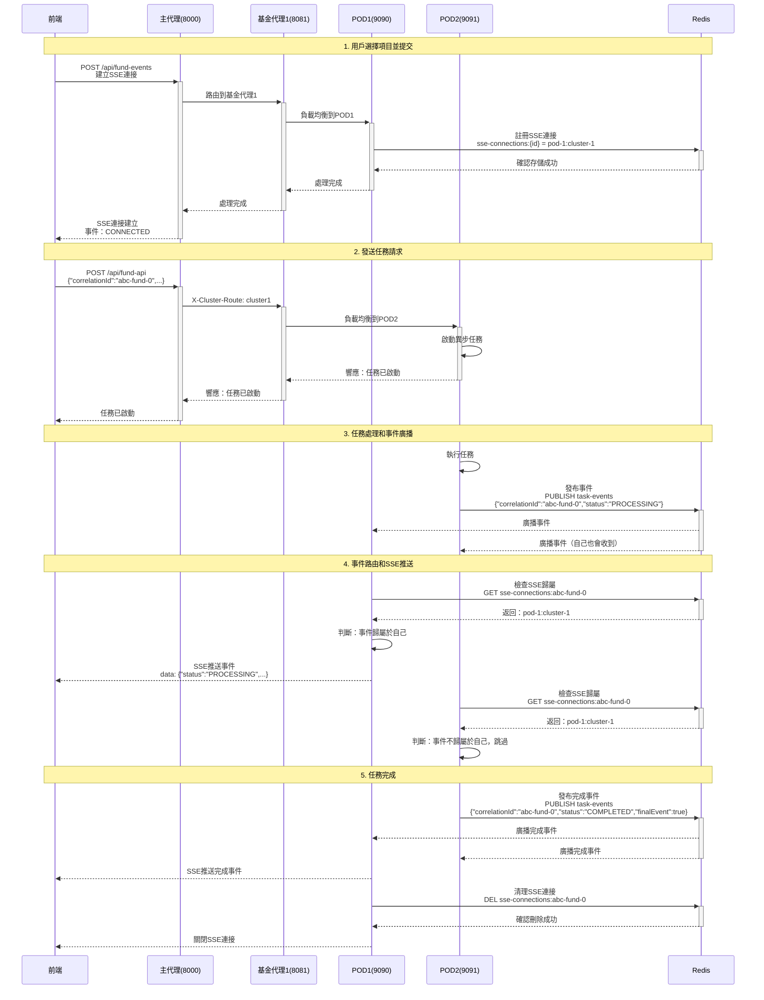
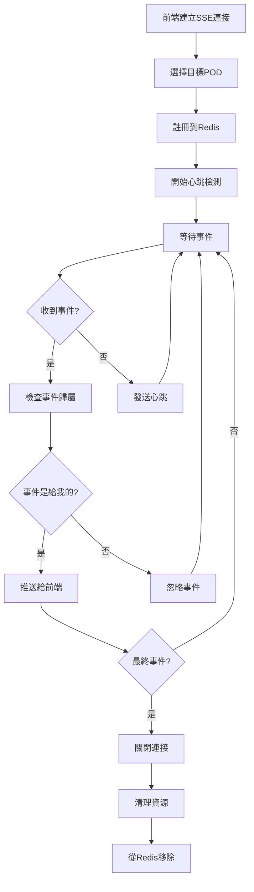
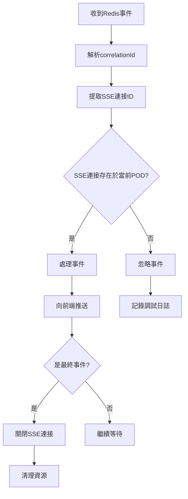

# 基金債券處理系統 - 技術架構與實現

## 📋 目錄
1. [系統概述](#系統概述)
2. [技術選型](#技術選型)
3. [架構設計](#架構設計)
4. [Redis核心機制](#redis核心機制)
5. [POD身份管理](#pod身份管理)
6. [詳細流程圖](#詳細流程圖)
7. [關鍵組件實現](#關鍵組件實現)
8. [事件驅動機制](#事件驅動機制)
9. [負載均衡策略](#負載均衡策略)
10. [部署實踐](#部署實踐)

---

## 🎯 系統概述

這是一個基於微服務架構的基金債券處理平台，採用三層代理設計實現高可用性和水平擴展。系統支持多項目並行處理、實時進度追蹤、跨實例事件通信。

### 核心設計原則
- **三層代理架構**：主反向代理 → 集群代理 → 業務實例
- **事件驅動通信**：基於Redis Pub/Sub的跨實例消息傳遞
- **智能路由分發**：Header驅動的集群路由與負載均衡
- **實時進度推送**：Server-Sent Events實現的實時更新
- **動態身份識別**：主機名+端口的POD唯一標識方案

---

## 🛠 技術棧

### 後端技術
| 技術 | 版本 | 用途 |
|------|------|------|
| **Spring Boot** | 3.1.0 | 微服務框架 |
| **Spring Cloud Gateway** | 4.0.7 | API網關和反向代理 |
| **Spring WebFlux** | 6.0.13 | 響應式Web框架 |
| **Redis** | 6.2 | 分布式緩存和消息中間件 |
| **Jedis** | 4.3.2 | Redis Java客戶端 |
| **Jackson** | 2.15.0 | JSON序列化/反序列化 |
| **Lombok** | 1.18.30 | 代碼生成工具 |
| **Maven** | 3.9.9 | 構建工具 |

### 前端技術
| 技術 | 版本 | 用途 |
|------|------|------|
| **Angular** | 18.2 | 前端框架 |
| **Angular Material** | 最新 | UI組件庫 |
| **RxJS** | 最新 | 響應式編程 |
| **TypeScript** | 最新 | 類型安全 |
| **Server-Sent Events** | 原生 | 實時數據推送 |

### 基礎設施
| 組件 | 用途 |
|------|------|
| **Docker** | 容器化部署（可選） |
| **Nginx** | 生產環境反向代理（可選） |
| **Redis Cluster** | 生產環境高可用（可選） |

---

## 🏗 架構設計

### 整體架構圖

```
┌─────────────────────────────────────────────────────────────────┐
│                        前端層 (Frontend)                        │
├─────────────────────────────────────────────────────────────────┤
│  Angular SPA (Port 4200)                                       │
│  ├─ TaskService (SSE管理)                                      │
│  ├─ FundBondService (API調用)                                  │
│  └─ 實時進度組件                                                │
└─────────────────┬───────────────────────────────────────────────┘
                  │ HTTP/SSE
┌─────────────────▼───────────────────────────────────────────────┐
│                     API網關層 (Gateway)                         │
├─────────────────────────────────────────────────────────────────┤
│  主反向代理 (Port 8000)                                         │
│  ├─ Spring Cloud Gateway                                       │
│  ├─ 路由規則：基於 X-Cluster-Route Header                      │
│  └─ 負載均衡：輪詢分發                                         │
└─────────────┬─────────────────┬─────────────────────────────────┘
              │                 │
      ┌───────▼──────┐   ┌─────▼──────┐
      │ 基金代理1     │   │ 基金代理2   │
      │ (Port 8081)  │   │ (Port 8082) │
      └───────┬──────┘   └─────┬──────┘
              │                │
    ┌─────────▼─────┐    ┌─────▼─────┐
    │ 集群1         │    │ 集群2      │
    │ ┌───────────┐ │    │ ┌───────────┐ │
    │ │ POD1:9090 │ │    │ │ POD3:9092 │ │
    │ │ POD2:9091 │ │    │ │ POD4:9093 │ │
    │ └───────────┘ │    │ └───────────┘ │
    └───────┬───────┘    └─────┬─────────┘
            │                  │
        ┌───▼──────────────────▼───┐
        │     Redis (Port 6379)    │
        │  ┌─────────────────────┐  │
        │  │  Pub/Sub 事件總線   │  │
        │  │  ├─ task-events    │  │
        │  │  └─ 跨POD事件廣播   │  │
        │  └─────────────────────┘  │
        │  ┌─────────────────────┐  │
        │  │  連接註冊中心        │  │
        │  │  └─ sse-connections │  │
        │  └─────────────────────┘  │
        └──────────────────────────┘
```

### 服務端口分配

| 服務 | 端口 | 說明 |
|------|------|------|
| 前端 | 4200 | Angular開發服務器 |
| 主反向代理 | 8000 | 統一入口點 |
| 基金代理1 | 8081 | 管理集群1 (POD1,POD2) |
| 基金代理2 | 8082 | 管理集群2 (POD3,POD4) |
| 基金系統POD1 | 9090 | 基金處理服務實例1 |
| 基金系統POD2 | 9091 | 基金處理服務實例2 |
| 基金系統POD3 | 9092 | 基金處理服務實例3 |
| 基金系統POD4 | 9093 | 基金處理服務實例4 |
| Redis | 6379 | 消息中間件和緩存 |

---

## 🏷️ POD身份管理

### 動態身份生成策略

為解決生產環境中相同端口多主機部署的問題，採用主機名+端口組合生成唯一POD標識：

```java
@Configuration
public class PodIdentityConfig {
    
    @Bean
    public String podId() {
        String hostName = getHostName();
        String simplifiedHost = simplifyHostName(hostName);
        return "pod-" + simplifiedHost + "-" + serverPort;
    }
    
    private String simplifyHostName(String hostName) {
        // 移除域名後綴，保留主要標識
        String simplified = hostName.split("\\.")[0];
        // 清理常見前綴，提取核心標識
        simplified = simplified.replaceAll("^(pod|node|host|server)-?", "");
        return simplified.toLowerCase();
    }
}
```

**生成範例**：
- `host-app-01.company.com` → `pod-app01-9090`
- `k8s-pod-abc123` → `pod-abc123-9092`
- `docker-container-456` → `pod-456-9090`

### 配置策略

**集群級配置**：
- `application-cluster1.properties` - 集群1配置
- `application-cluster2.properties` - 集群2配置

**部署方式**：
```bash
# 集群1不同主機，相同配置
# 主機A
java -jar app.jar --spring.config.additional-location=classpath:application-cluster1.properties --server.port=9090
# 生成: pod-hostA-9090

# 主機B  
java -jar app.jar --spring.config.additional-location=classpath:application-cluster1.properties --server.port=9090
# 生成: pod-hostB-9090
```

---

## 🔴 Redis核心機制

### 1. 事件廣播中心 (Pub/Sub)

Redis作為**分布式事件總線**，實現跨POD的事件通信：

```java
// 發布事件
redisTemplate.convertAndSend("task-events", taskEvent);

// 訂閱事件
@Override
public void onMessage(Message message, byte[] pattern) {
    TaskEvent event = mapper.readValue(message.getBody(), TaskEvent.class);
    // 處理事件...
}
```

**頻道設計：**
- `task-events`：任務事件主頻道
- 所有POD都訂閱此頻道
- 事件包含：`correlationId`, `status`, `message`, `result`, `finalEvent`

### 2. SSE連接註冊中心

Redis存儲SSE連接與POD的映射關係：

```
Key格式：sse-connections:{sseConnectionId}
Value：{podId}:{clusterId}
TTL：24小時
```

**實現原理：**
```java
// 註冊SSE連接
public void registerSseConnection(String sseConnectionId, String podId, String clusterId) {
    String key = "sse-connections:" + sseConnectionId;
    String value = podId + ":" + clusterId;
    redisTemplate.opsForValue().set(key, value, Duration.ofHours(24));
}

// 檢查連接是否在當前POD
public boolean isSseConnectionLocal(String sseConnectionId) {
    String key = "sse-connections:" + sseConnectionId;
    String stored = redisTemplate.opsForValue().get(key);
    String current = podId + ":" + clusterId;
    return current.equals(stored);
}
```

### 3. 分布式鎖和狀態管理

Redis還可擴展用於：
- 分布式鎖：防止重複任務執行
- 任務狀態緩存：快速查詢任務進度
- 配置中心：動態配置更新

---

## 📊 詳細流程圖

### 主要業務流程時序圖



### SSE連接生命周期



### 事件處理決策樹



---

## 🔧 關鍵組件實現

### 1. TaskService - 核心業務服務

```java
@Service
@RequiredArgsConstructor
@Slf4j
public class TaskService {
    // SSE連接管理
    private final Map<String, SseEmitter> sseEmitterMap = new ConcurrentHashMap<>();
    
    // 心跳管理
    private final Map<String, ScheduledFuture<?>> heartbeatFutureMap = new ConcurrentHashMap<>();
    
    // 任務追蹤
    private final Map<String, List<String>> sseConnectionTaskIdsMap = new ConcurrentHashMap<>();
    
    // 完成狀態追蹤
    private final Map<String, Set<String>> sseConnectionCompletedTasksMap = new ConcurrentHashMap<>();

    public SseEmitter createSseEmitter(String sseConnectionId, List<String> taskIds) {
        // 1. 創建SSE發射器
        // 2. 註冊到Redis
        // 3. 啟動心跳
        // 4. 設置事件處理器
    }

    @Async
    public void processTaskAsync(TaskRequest request) {
        // 1. 發布開始事件
        // 2. 執行子任務
        // 3. 發布進度事件
        // 4. 發布完成事件
    }
}
```

### 2. RedisEventService - 事件廣播服務

```java
@Service
@RequiredArgsConstructor
@Slf4j
public class RedisEventService implements MessageListener {
    
    public void publishEvent(TaskEvent event) {
        // 直接發送對象，讓RedisTemplate處理序列化
        redisTemplate.convertAndSend(EVENT_CHANNEL, event);
    }

    @Override
    public void onMessage(Message message, byte[] pattern) {
        // 1. 反序列化事件
        // 2. 提取SSE連接ID
        // 3. 檢查事件歸屬
        // 4. 調用TaskService處理
    }
}
```

### 3. 前端TaskService - SSE客戶端

```typescript
export class TaskService {
    private connections = new Map<string, SseConnection>();

    public connectToEventStream(correlationId: string, system: SystemType, taskIds?: string[]): void {
        // 1. 建立AbortController
        // 2. 發送SSE請求
        // 3. 處理事件流
        // 4. 管理連接生命周期
    }

    private createSseObservable(): Observable<void> {
        // 1. 建立Fetch請求
        // 2. 讀取Stream
        // 3. 解析SSE格式
        // 4. 處理事件
    }
}
```

### 4. 主反向代理配置

```yaml
spring:
  cloud:
    gateway:
      routes:
        - id: fund-cluster1
          uri: lb://fund-proxy-cluster1
          predicates:
            - Path=/api/**
            - Header=X-Cluster-Route, cluster1
          filters:
            - StripPrefix=0
            
        - id: fund-cluster2  
          uri: lb://fund-proxy-cluster2
          predicates:
            - Path=/api/**
            - Header=X-Cluster-Route, cluster2
          filters:
            - StripPrefix=0
```

---

## ⚡ 事件驅動機制

### 事件類型定義

```java
public class TaskEvent {
    private String correlationId;  // 任務關聯ID
    private String status;         // 事件狀態
    private String message;        // 事件消息
    private Object result;         // 執行結果
    private boolean finalEvent;    // 是否為最終事件
}
```

### 事件狀態流轉

```
CONNECTED → PROCESSING → SUBTASK_COMPLETED → ... → COMPLETED/FAILED
    ↓           ↓              ↓                        ↓
  連接建立    任務開始        子任務完成               任務結束
```

### 事件路由邏輯

1. **事件發布**：任何POD都可以發布事件到Redis
2. **事件廣播**：Redis將事件廣播給所有訂閱的POD
3. **歸屬檢查**：每個POD檢查事件是否屬於自己管理的SSE連接
4. **智能過濾**：只有負責該SSE連接的POD才處理事件
5. **前端推送**：通過SSE將事件推送給前端

### 心跳機制

```java
// 每10秒發送一次心跳
ScheduledFuture<?> future = HEARTBEAT_SCHEDULER.scheduleAtFixedRate(() -> {
    TaskEvent heartbeatEvent = TaskEvent.builder()
        .correlationId(correlationId)
        .status("HEARTBEAT")
        .message("基金系統心跳檢測")
        .finalEvent(false)
        .build();
    emitter.send(SseEmitter.event().name("HEARTBEAT").data(heartbeatEvent));
}, 2, 10, TimeUnit.SECONDS);
```

---

## 🔄 負載均衡與高可用

### 負載均衡策略

1. **代理層負載均衡**：
   - 基金代理1/2使用Spring Cloud LoadBalancer
   - 輪詢算法分發請求到不同POD
   - 健康檢查確保只路由到健康的POD

2. **SSE連接分散**：
   - 不同用戶的SSE連接分散到不同POD
   - 通過Redis註冊中心記錄連接歸屬
   - 事件智能路由到正確的POD

### 容錯機制

1. **連接異常處理**：
   ```java
   emitter.onError(ex -> {
       log.error("SSE連接錯誤", ex);
       cleanupSseResources(sseConnectionId);
       emitter.complete();
   });
   ```

2. **Redis連接重試**：
   - Spring Data Redis自動重連
   - 連接池管理
   - 超時配置

3. **優雅關閉**：
   - 服務停止時清理所有SSE連接
   - Redis中的連接註冊自動過期
   - 前端自動重連機制

### 監控指標

- SSE連接數量
- Redis Pub/Sub延遲
- POD健康狀態
- 任務處理時間
- 事件廣播成功率

---

## 🚀 部署指南

### 本地開發環境

1. **啟動Redis**：
   ```bash
   brew services start redis@6.2
   ```

2. **啟動後端服務**：
   ```bash
   ./start-all.sh
   ```

3. **啟動前端**：
   ```bash
   cd frontend && npm start
   ```

### 生產環境部署

1. **Redis集群部署**：
   ```yaml
   # docker-compose.yml
   version: '3.8'
   services:
     redis-master:
       image: redis:6.2-alpine
       ports:
         - "6379:6379"
     redis-replica:
       image: redis:6.2-alpine  
       command: redis-server --slaveof redis-master 6379
   ```

2. **應用服務部署**：
   ```dockerfile
   FROM openjdk:17-jre-slim
   COPY target/fund-system.jar app.jar
   EXPOSE 9090
   ENTRYPOINT ["java", "-jar", "/app.jar"]
   ```

3. **Nginx反向代理**：
   ```nginx
   upstream main-proxy {
       server app1:8000;
       server app2:8000;
   }
   
   server {
       listen 80;
       location / {
           proxy_pass http://main-proxy;
           proxy_set_header Host $host;
           proxy_set_header X-Real-IP $remote_addr;
       }
   }
   ```

### 配置管理

```yaml
# application-prod.yml
spring:
  redis:
    host: redis-cluster.example.com
    port: 6379
    password: ${REDIS_PASSWORD}
    jedis:
      pool:
        max-active: 20
        max-idle: 10
        min-idle: 5

app:
  pod:
    id: ${POD_ID:pod-1}
  cluster:
    id: ${CLUSTER_ID:cluster-1}
```

---

## 📈 性能優化建議

### 1. Redis優化
- 啟用Redis持久化（AOF）
- 配置合適的內存限制
- 使用Redis Cluster提高可用性

### 2. SSE連接優化
- 設置合理的心跳間隔
- 實現連接池復用
- 添加連接數量限制

### 3. 事件處理優化
- 使用異步處理避免阻塞
- 實現事件批處理
- 添加事件過濾機制

### 4. 前端優化
- 實現SSE連接重試
- 添加離線檢測
- 使用Service Worker緩存

---

## 🔧 故障排除

### 常見問題

1. **SSE連接無法建立**：
   - 檢查CORS配置
   - 確認服務端口可達
   - 查看瀏覽器控制台錯誤

2. **事件無法接收**：
   - 檢查Redis連接狀態
   - 確認事件發布成功
   - 驗證SSE連接註冊

3. **Redis序列化錯誤**：
   - 確認Jackson配置正確
   - 檢查ObjectMapper設置
   - 驗證數據格式

### 調試工具

```bash
# 監控Redis活動
redis-cli monitor

# 檢查SSE連接
redis-cli KEYS "sse-connections:*"

# 測試事件發布
redis-cli PUBLISH task-events '{"correlationId":"test","status":"TEST"}'
```

---

## 📝 總結

本系統通過**Redis Pub/Sub + SSE + 三層代理架構**實現了一個高效、可擴展的實時事件處理平台：

### 核心優勢
1. **真正的實時性**：SSE提供低延遲的事件推送
2. **橫向擴展性**：支持任意數量的POD實例
3. **事件廣播**：Redis確保跨POD的事件一致性
4. **智能路由**：事件只推送給相關的客戶端
5. **高可用性**：多層代理提供故障轉移能力

### 適用場景
- 大批量數據處理進度追蹤
- 多用戶實時協作系統
- 分布式任務執行監控
- 微服務間事件通信

### 未來擴展
- 支持WebSocket雙向通信
- 集成消息隊列（RabbitMQ/Kafka）
- 添加分布式鎖機制
- 實現動態配置中心

</rewritten_file> 