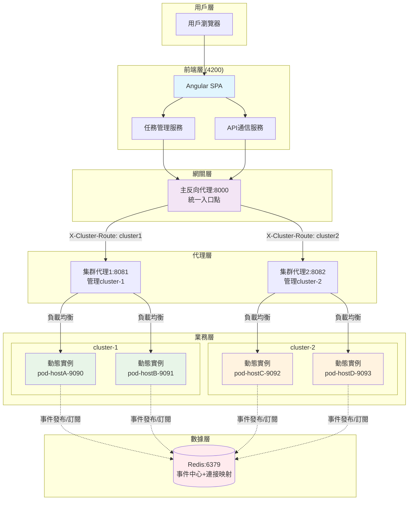
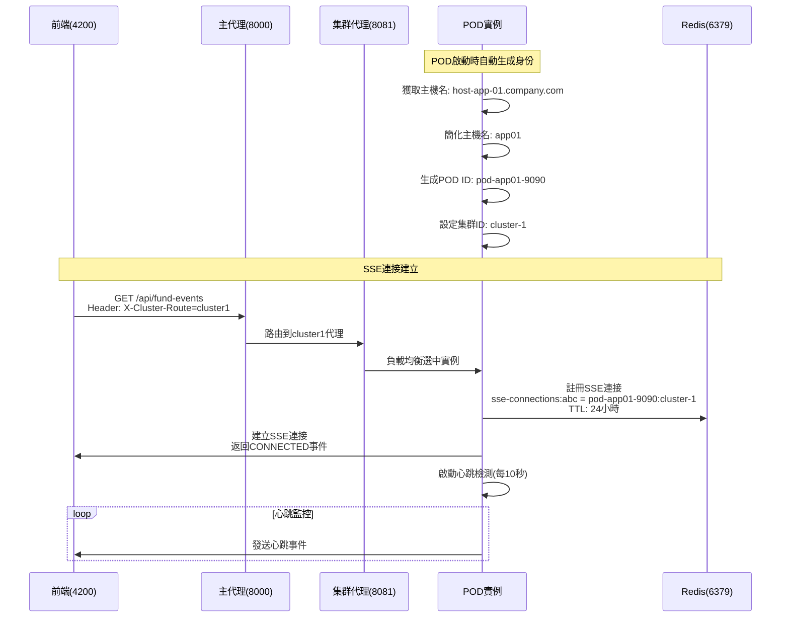
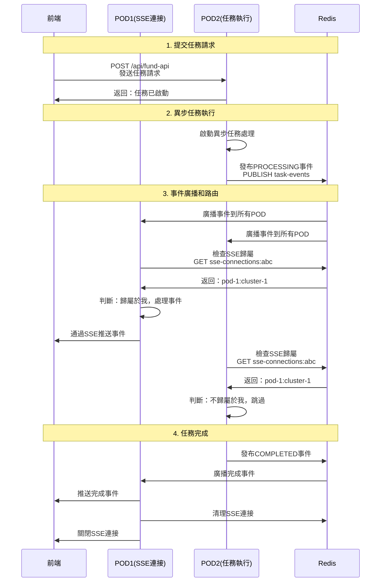
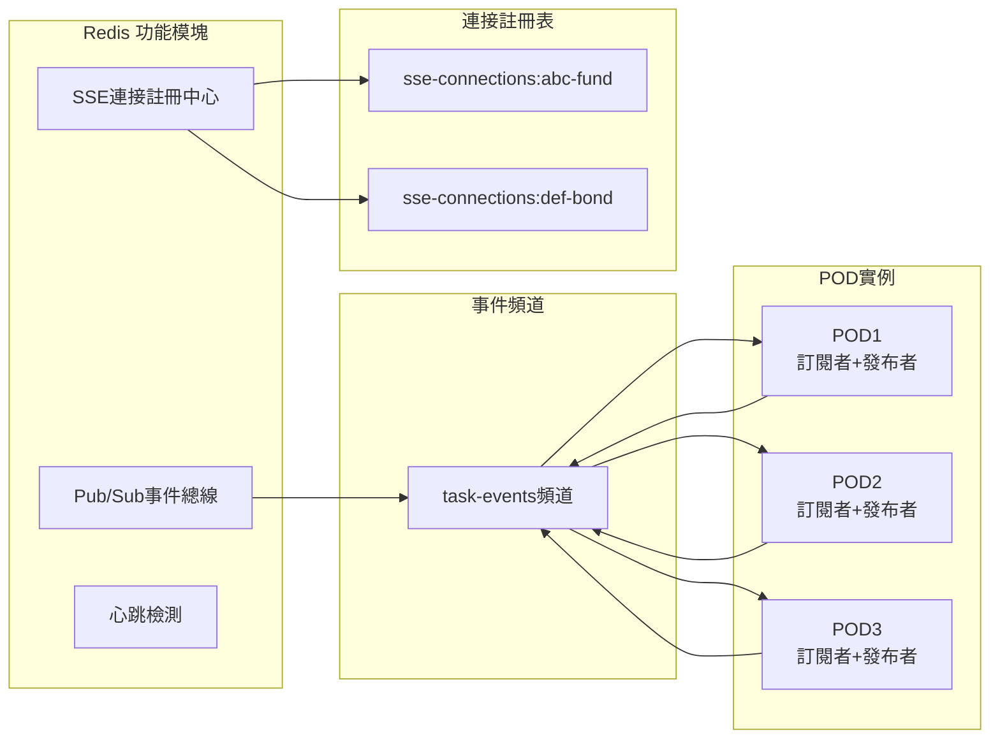
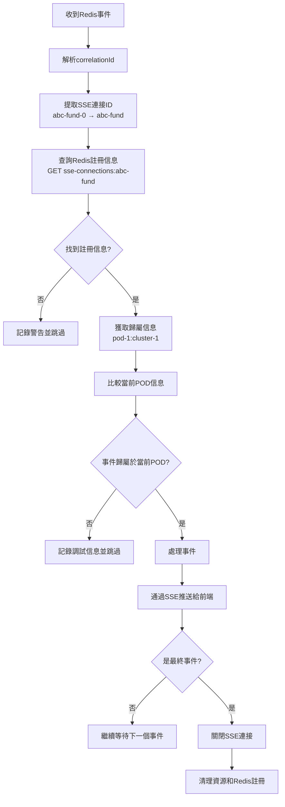
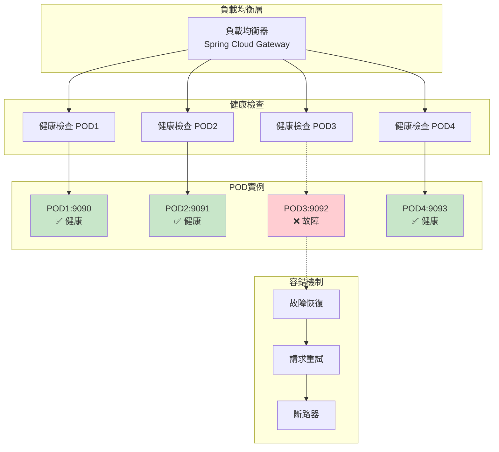
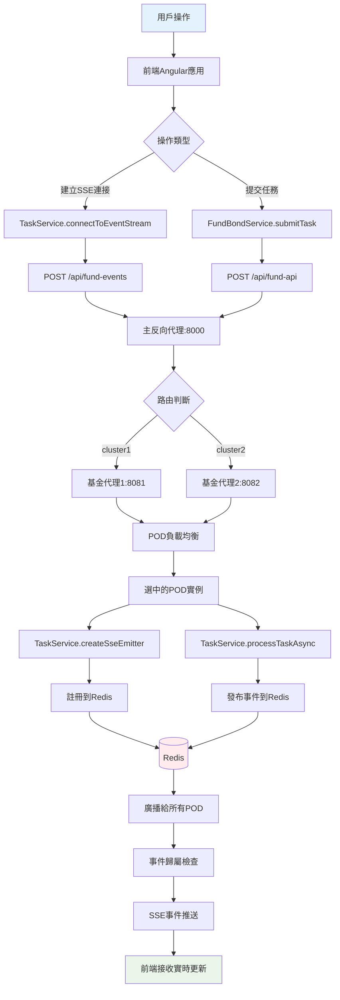

# 系統架構核心流程圖

## 1. 整體架構組件圖

```mermaid
graph TB
    subgraph "用戶層"
        U[用戶瀏覽器]
    end
    
    subgraph "前端層 (4200)"
        F[Angular SPA]
        TS[任務管理服務]
        FBS[API通信服務]
    end
    
    subgraph "網關層"
        MP[主反向代理:8000<br/>統一入口點]
    end
    
    subgraph "代理層"
        FP1[集群代理1:8081<br/>管理cluster-1]
        FP2[集群代理2:8082<br/>管理cluster-2]
    end
    
    subgraph "業務層"
        subgraph "cluster-1"
            POD1[動態實例<br/>pod-hostA-9090]
            POD2[動態實例<br/>pod-hostB-9091]
        end
        subgraph "cluster-2"
            POD3[動態實例<br/>pod-hostC-9092]
            POD4[動態實例<br/>pod-hostD-9093]
        end
    end
    
    subgraph "數據層"
        R[(Redis:6379<br/>事件中心+連接映射)]
    end
    
    U --> F
    F --> TS
    F --> FBS
    TS --> MP
    FBS --> MP
    MP -->|X-Cluster-Route: cluster1| FP1
    MP -->|X-Cluster-Route: cluster2| FP2
    FP1 -->|負載均衡| POD1
    FP1 -->|負載均衡| POD2
    FP2 -->|負載均衡| POD3
    FP2 -->|負載均衡| POD4
    POD1 -.->|事件發布/訂閱| R
    POD2 -.->|事件發布/訂閱| R
    POD3 -.->|事件發布/訂閱| R
    POD4 -.->|事件發布/訂閱| R
    
    style F fill:#e1f5fe
    style MP fill:#f3e5f5
    style R fill:#ffebee
    style POD1 fill:#e8f5e8
    style POD2 fill:#e8f5e8
    style POD3 fill:#fff3e0
    style POD4 fill:#fff3e0
```

## 2. SSE連接建立與POD身份管理

```mermaid
sequenceDiagram
    participant 前端 as 前端(4200)
    participant 主代理 as 主代理(8000)
    participant 集群代理 as 集群代理(8081)
    participant POD as POD實例
    participant Redis as Redis(6379)
    
    Note over POD: POD啟動時自動生成身份
    POD->>POD: 獲取主機名: host-app-01.company.com
    POD->>POD: 簡化主機名: app01
    POD->>POD: 生成POD ID: pod-app01-9090
    POD->>POD: 設定集群ID: cluster-1
    
    Note over 前端,Redis: SSE連接建立
    前端->>主代理: GET /api/fund-events<br/>Header: X-Cluster-Route=cluster1
    主代理->>集群代理: 路由到cluster1代理
    集群代理->>POD: 負載均衡選中實例
    POD->>Redis: 註冊SSE連接<br/>sse-connections:abc = pod-app01-9090:cluster-1<br/>TTL: 24小時
    POD->>前端: 建立SSE連接<br/>返回CONNECTED事件
    POD->>POD: 啟動心跳檢測(每10秒)
    
    loop 心跳監控
        POD->>前端: 發送心跳事件
    end
```

## 3. 任務處理和事件廣播流程

```mermaid
sequenceDiagram
    participant 前端 as 前端
    participant POD1 as POD1(SSE連接)
    participant POD2 as POD2(任務執行)
    participant Redis as Redis
    
    Note over 前端,Redis: 1. 提交任務請求
    前端->>POD2: POST /api/fund-api<br/>發送任務請求
    POD2->>前端: 返回：任務已啟動
    
    Note over 前端,Redis: 2. 異步任務執行
    POD2->>POD2: 啟動異步任務處理
    POD2->>Redis: 發布PROCESSING事件<br/>PUBLISH task-events
    
    Note over 前端,Redis: 3. 事件廣播和路由
    Redis->>POD1: 廣播事件到所有POD
    Redis->>POD2: 廣播事件到所有POD
    
    POD1->>Redis: 檢查SSE歸屬<br/>GET sse-connections:abc
    Redis->>POD1: 返回：pod-1:cluster-1
    POD1->>POD1: 判斷：歸屬於我，處理事件
    POD1->>前端: 通過SSE推送事件
    
    POD2->>Redis: 檢查SSE歸屬<br/>GET sse-connections:abc
    Redis->>POD2: 返回：pod-1:cluster-1
    POD2->>POD2: 判斷：不歸屬於我，跳過
    
    Note over 前端,Redis: 4. 任務完成
    POD2->>Redis: 發布COMPLETED事件
    Redis->>POD1: 廣播完成事件
    POD1->>前端: 推送完成事件
    POD1->>Redis: 清理SSE連接
    POD1->>前端: 關閉SSE連接
```

## 4. Redis核心功能

```mermaid
graph LR
    subgraph "Redis 功能模塊"
        PS[Pub/Sub事件總線]
        SR[SSE連接註冊中心]
        HB[心跳檢測]
    end
    
    subgraph "事件頻道"
        TE[task-events頻道]
    end
    
    subgraph "連接註冊表"
        SSE1[sse-connections:abc-fund]
        SSE2[sse-connections:def-bond]
    end
    
    subgraph "POD實例"
        P1[POD1<br/>訂閱者+發布者]
        P2[POD2<br/>訂閱者+發布者]
        P3[POD3<br/>訂閱者+發布者]
    end
    
    PS --> TE
    SR --> SSE1
    SR --> SSE2
    TE --> P1
    TE --> P2
    TE --> P3
    P1 --> TE
    P2 --> TE
    P3 --> TE
```

## 5. 事件路由決策流程

```mermaid
flowchart TD
    A[收到Redis事件] --> B[解析correlationId]
    B --> C[提取SSE連接ID<br/>abc-fund-0 → abc-fund]
    C --> D[查詢Redis註冊信息<br/>GET sse-connections:abc-fund]
    D --> E{找到註冊信息?}
    E -->|否| F[記錄警告並跳過]
    E -->|是| G[獲取歸屬信息<br/>pod-1:cluster-1]
    G --> H[比較當前POD信息]
    H --> I{事件歸屬於當前POD?}
    I -->|否| J[記錄調試信息並跳過]
    I -->|是| K[處理事件]
    K --> L[通過SSE推送給前端]
    L --> M{是最終事件?}
    M -->|否| N[繼續等待下一個事件]
    M -->|是| O[關閉SSE連接]
    O --> P[清理資源和Redis註冊]
```

## 6. 負載均衡和高可用架構

```mermaid
graph TB
    subgraph "負載均衡層"
        LB[負載均衡器<br/>Spring Cloud Gateway]
    end
    
    subgraph "健康檢查"
        HC1[健康檢查 POD1]
        HC2[健康檢查 POD2]
        HC3[健康檢查 POD3]
        HC4[健康檢查 POD4]
    end
    
    subgraph "POD實例"
        POD1[POD1:9090<br/>✅ 健康]
        POD2[POD2:9091<br/>✅ 健康]
        POD3[POD3:9092<br/>❌ 故障]
        POD4[POD4:9093<br/>✅ 健康]
    end
    
    subgraph "容錯機制"
        FR[故障恢復]
        RT[請求重試]
        CB[斷路器]
    end
    
    LB --> HC1
    LB --> HC2
    LB --> HC3
    LB --> HC4
    
    HC1 --> POD1
    HC2 --> POD2
    HC3 -.-> POD3
    HC4 --> POD4
    
    POD3 -.-> FR
    FR --> RT
    RT --> CB
    
    style POD3 fill:#ffcdd2
    style POD1 fill:#c8e6c9
    style POD2 fill:#c8e6c9
    style POD4 fill:#c8e6c9
```

## 7. 完整的數據流向圖

```mermaid
graph TD
    A[用戶操作] --> B[前端Angular應用]
    B --> C{操作類型}
    
    C -->|建立SSE連接| D[TaskService.connectToEventStream]
    C -->|提交任務| E[FundBondService.submitTask]
    
    D --> F[POST /api/fund-events]
    E --> G[POST /api/fund-api]
    
    F --> H[主反向代理:8000]
    G --> H
    
    H --> I{路由判斷}
    I -->|cluster1| J[基金代理1:8081]
    I -->|cluster2| K[基金代理2:8082]
    
    J --> L[POD負載均衡]
    K --> L
    
    L --> M[選中的POD實例]
    M --> N[TaskService.createSseEmitter]
    M --> O[TaskService.processTaskAsync]
    
    N --> P[註冊到Redis]
    O --> Q[發布事件到Redis]
    
    P --> R[(Redis)]
    Q --> R
    
    R --> S[廣播給所有POD]
    S --> T[事件歸屬檢查]
    T --> U[SSE事件推送]
    U --> V[前端接收實時更新]
    
    style A fill:#e3f2fd
    style R fill:#ffebee
    style V fill:#e8f5e8
```